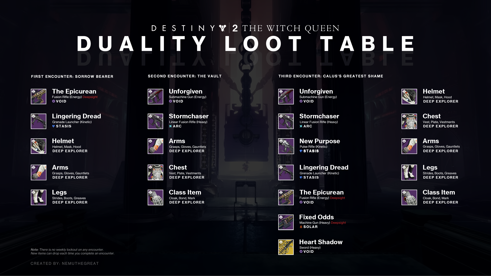
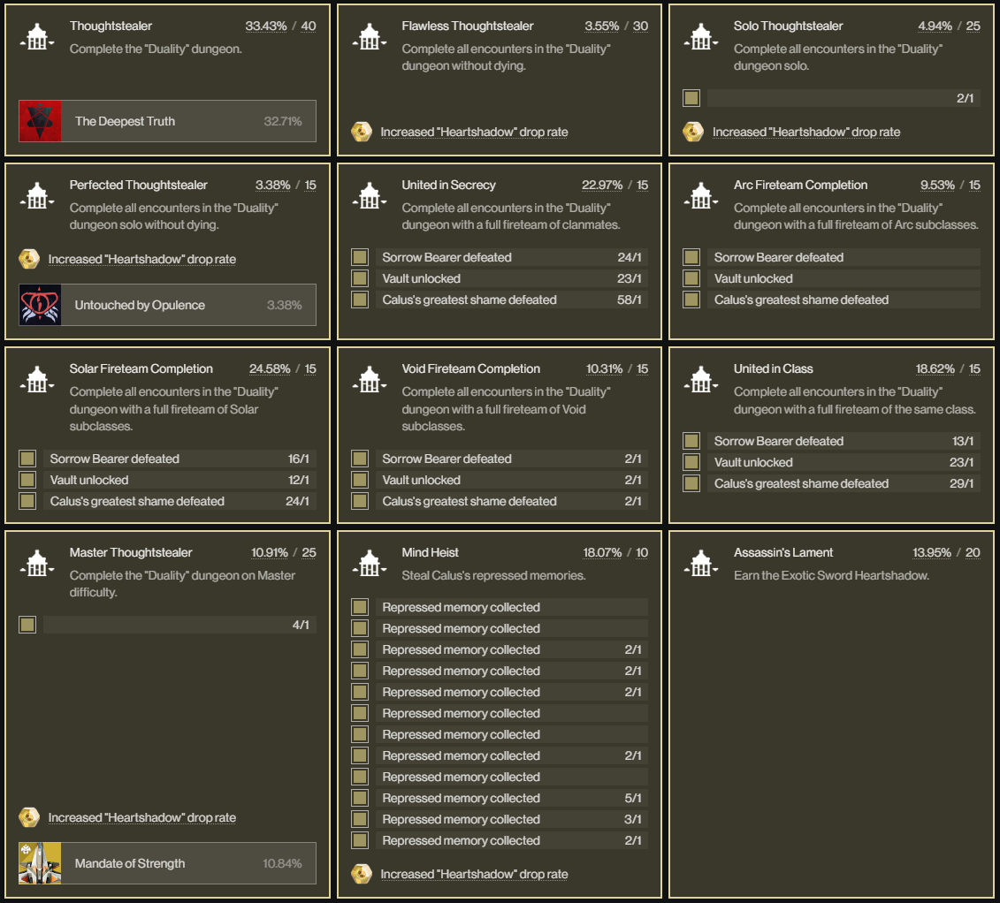

<!-- 

Template for links to open in new tab:

<a href="[url]" target="_blank">[display_text]</a> 

-->

Duality
====================================================================

Released: 27 May 2022

Power level:

- Normal: {{ dungeons.duality_normal }}
- Master: {{ dungeons.duality_master }}

Loot table
--------------------------------------------------------------------

<figure markdown>
  { loading=lazy }
  <figcaption>Duality loot table</figcaption>
</figure>

Video Guides
--------------------------------------------------------------------

Here are some of the popular video guides for the dungeon:

<a href="https://www.youtube.com/watch?v=WniU18Fuo4k" target="_blank">Datto - Destiny 2: Full Duality Dungeon Guide & Secret Memory and Chest Locations</a> 

<a href="https://www.youtube.com/watch?v=LHTIiDvPC94" target="_blank">Fallout Plays - Destiny 2: Complete DUALITY Dungeon Guide (& Final Boss 1 Phase!)</a> 

<a href="https://www.youtube.com/watch?v=6QGD1nK5RT4" target="_blank">Esoterickk - All 12 Duality Dungeon Collectibles Location Guide - All of Calus's Repressed Memories [Destiny 2]</a> 

<a href="https://www.youtube.com/watch?v=E5B9vwYAhE8" target="_blank">Aztecross - The Complete Duality Dungeon Guide (All Secret Chests + MASTER) | Destiny 2 Season of the Haunted</a> 

Walkthrough
--------------------------------------------------------------------

Introduction

The Duality dungeon is available from the moon:leviathan node. If you don't see the node for it, or have never done the dungeon before, you'll have to talk to Suraya Hawthorne(sp?) first and obtain a quest item for some reason.

### First loading in

When you first arrive into Duality, you'll be at the end of a hallway. Walk forward towards Eris Moan and wait for her to finish talking. While you wait, admire the Calus statue.

Once she's done talking, the floor around the Calus statue will disappear and you'll fall down into the first transition area.

### Getting to the first encounter

Upon dropping down from Eris, walk forward to the fence ahead of you and you'll be introduced to one of the recurring mechanics of the dungeon: the bells.

#### Bell Mechanic
(insert picture of the first bell)

The bell mechanic can best be described as a trigger to change between realms, the `Normal Realm` the `Nightmare Realm`. 

- `Normal Realm` - Everyday regular destiny
- `Nightmare Realm` - Everything is red and darker

There are certain map geometries/interactibles that are only available in one of the given realms. Our goal is to use the bells to navigate through the transition area, swapping between realms as needed to progress.

#### Steps

(describe the process of getting to the first encounter in granular detail, providing many pictures along the way)

### First encounter

#### Overview

(provide high-level overview of the encounter as a whole)

#### Mechanics

(list and describe any new mechanics)

#### Loadouts

(list helpful subclass/weapon choices and why)

#### Steps

(textual walkthrough of the whole encounter)

### Transition to second encounter

(describe the process of getting to the second encounter in granular detail, providing many pictures along the way)

### Second encounter

#### Overview

(provide high-level overview of the encounter as a whole)

#### Mechanics

(list and describe any new mechanics)

#### Loadouts

(list helpful subclass/weapon choices and why)

#### Steps

(textual walkthrough of the whole encounter)

### Transition to final encounter

(describe the process of getting to the final encounter in granular detail, providing many pictures along the way)

### Final encounter

#### Overview

(provide high-level overview of the encounter as a whole)

#### Mechanics

(list and describe any new mechanics)

#### Loadouts

(list helpful subclass/weapon choices and why)

#### Steps

(textual walkthrough of the whole encounter)

Master mode
--------------------------------------------------------------------

Along with the obvious increase in activity power level, here are the following changes for the Master version:

- Match Game is enabled
- Bellkeepers throughout the dungeon have void shields
- First encounter:
    - When depositing a Standard, the Colossus are now Unstoppable Champions.
- Second encounter:
    - The Colossus are now Barrier Champions on the platforms where you grab the Standard.
- Boss encounter:
    - The Colossus in the `Nightmare Realm` are now Barrier Champions. 

Triumphs
--------------------------------------------------------------------

<figure markdown>
  { loading=lazy }
  <figcaption>Duality triumphs</figcaption>
</figure>
